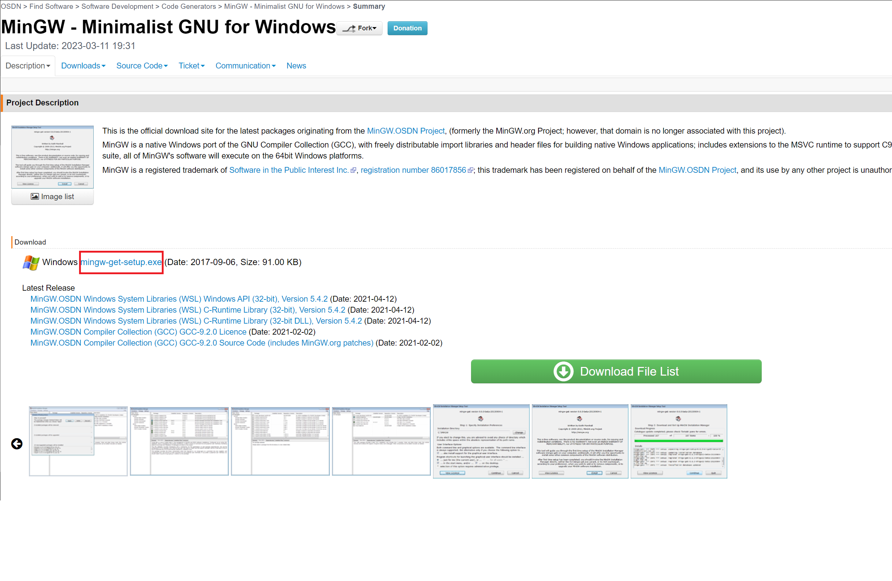
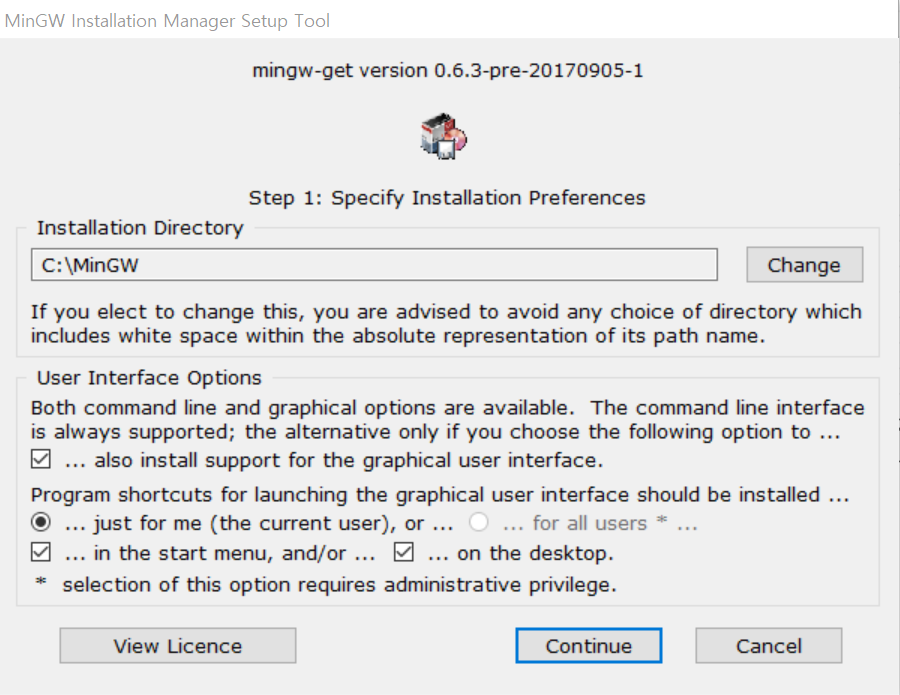
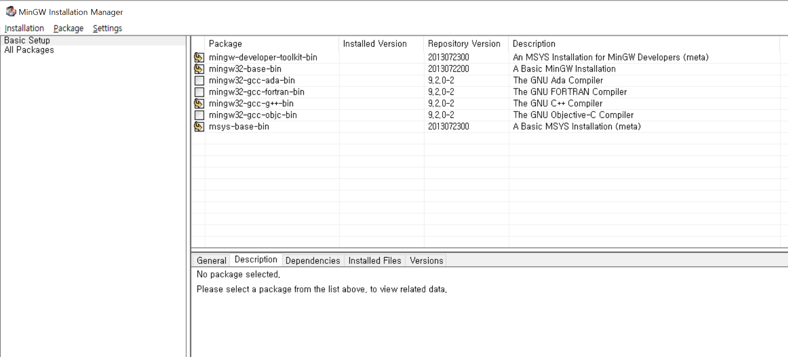
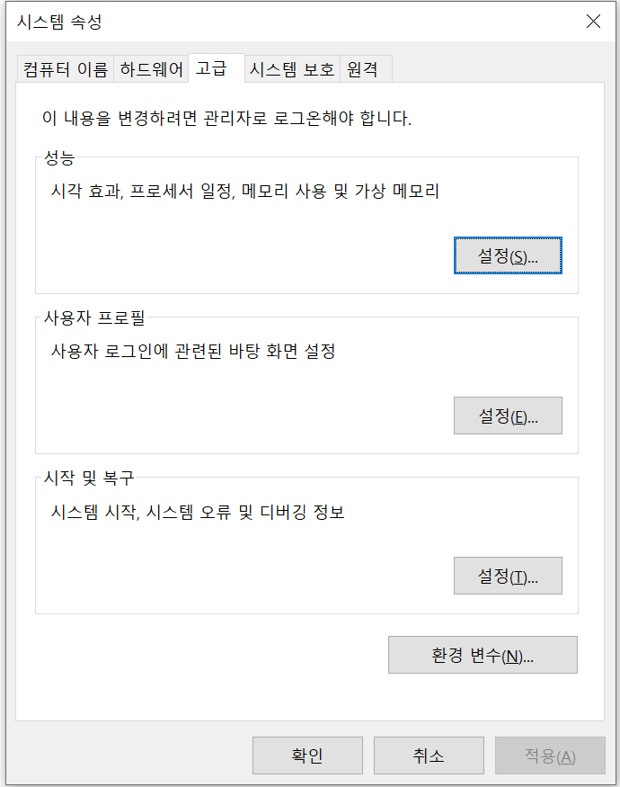
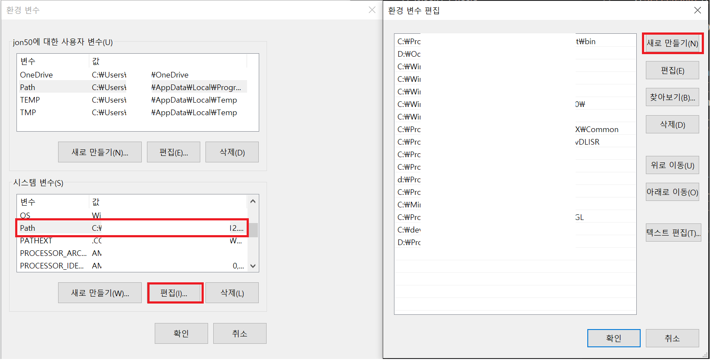
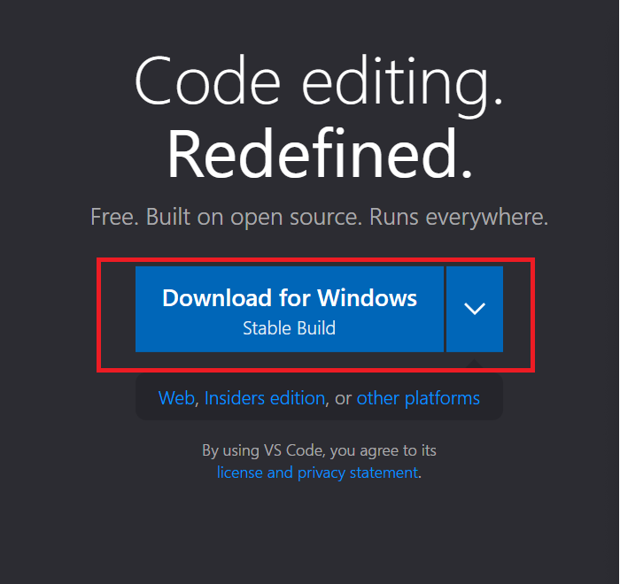
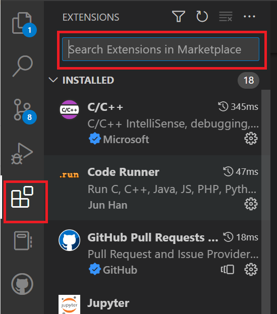
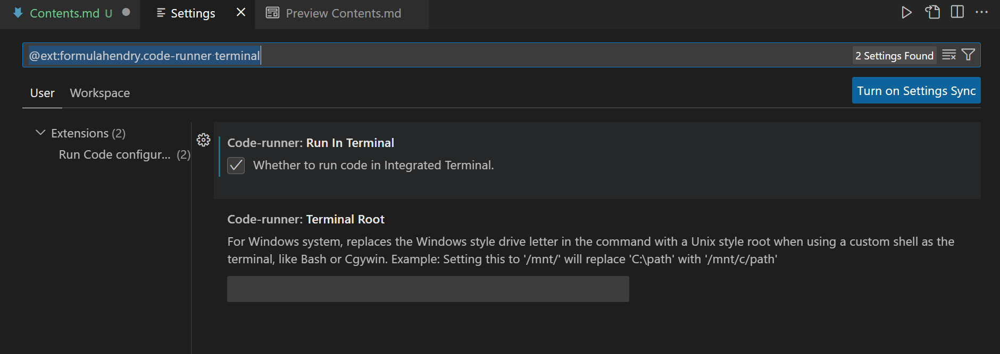

# 설치 프로그램

> MinGW (컴파일, 빌드 도구)   
[Link](https://osdn.net/projects/mingw/)
   
> Visual Studio Code (텍스트 편집기)   
[Link](https://code.visualstudio.com/)

- - - 
   
# MinGW Setup   

설정 순서
1. MinGW Installation manager 설치
2. MinGW Installation manager에서 Package 설치
3. 환경변수 설정

## 1. MinGW Installation manager 설치
</img>   
빨간 표시 링크 클릭. 설치 파일 다운로드하고 실행 이후 "Install" 버튼 클릭   
.   
.   
</img>   
위 화면에서 설치위치 지정하고 "Continue" 버튼 클릭   
!!! 설치 위치에 따라 환경변수 경로가 달라짐. 위 경로 복사해둘 것.   
.   
.   
## 2. MinGW Installation manager에서 설치할 Package 설치
</img>   
Installation manager에서 Package 4개에 각각 마우스 오른쪽 "Mark for Installation" 선택   
위와 같이 체크되어 있다면 왼쪽 상단 메뉴에서 "Installation -> Apply Changes",   
창 하나 뜨고 "Apply" 버튼 클릭하면 Package를 설치하는데 완료되면 설치 끝   
.   
.   
## 3. 환경변수 설정
Windows키(ctrl 옆의 키) + R 누르면 실행이라는 창이 나오고 "열기"에 **sysdm.cpl ,3** 입력 후 확인   
</img>   
위와 같은 창이 나오고 "환경 변수" 클릭   
.   
.   
</img>   
"시스템 변수"에서 변수 열의 "Path" 라고 되어있는 항목 누르고 "편집" 클릭   
"새로만들기" 하고 1번 항목에서 복사해둔 MinGW 경로를 붙여넣고 \bin 을 추가로 입력   
!!! 경로 수정 안했을때의 경로
```
C:\MinGW\bin
```
.   
.   
- - -

# VSCode Setup   
설정 순서   
1. VSCode 설치
2. Extensions 설치
3. Extensions 설정
4. 폴더 생성

## 1. VSCode 설치
</img>   
Visual Studio Code 설치파일 다운로드 후 설치, 실행   
.   
.   
## 2. Extensions 설치
</img>   
사이드 바에서 Extensions를 누르고 위의 캡쳐의 검색창에 설치할 Extension 검색 후 "Install" 클릭   
아래 두개의 Extension 검색 후 설치
```
Code Runner
C/C++
```
.   
.   
## 3. Extensions 설정
</img>   
상단 메뉴에서 "File -> Preferences -> Settings" (단축키 Ctrl + ,)   
Settings 창에서 상단의 Search settings에 아래의 문장 복사, 붙여넣기하면 위의 화면이 됨. 위의 Run In Terminal 옵션에 체크
```
@ext:formulahendry.code-runner RunInTerminal
```
.   
.   
## 4. 폴더 생성 이후 코드 실행
상단 메뉴에서 "File -> Open Folder" 원하는 폴더 선택하고 해당 폴더에서 새폴더 만든 후 만든 폴더 이름 변경하고 폴더선택   
.c 확장자로 파일 생성, 코드 작성하고 해당 창에서 "마우스 오른쪽 클릭 -> Run Code" (단축키 Ctrl + Alt + N) 하시면 프로그램 실행가능 합니다.   